# Аналитика и метамодель VAD/BCD нотаций (ver3)

Документ отвечает на четыре вопроса:

1. Почему существует так много VAD-подобных нотаций - и почему BCD не должна быть в их числе.
2. Какая универсальная метамодель связывает все девять нотаций ver3VAD.
3. Где Stormbpmn BCD ломает контракт BCD, заменяя его BPMN.
4. Что мы упрощаем в ver3VAD по сравнению с "настоящими" реализациями (Comindware, Business Studio) и почему.

Документ намеренно неполиткорректный: где нотация плохо подходит для своей задачи, мы это указываем без обтекаемых формулировок.

## 1. Зачем столько похожих нотаций

VAD/BCD-подобные нотации появились из разных практических контекстов:

- **ARIS VAD** - часть единой методологии ARIS. Привязка к ARIS-инструменту делает нотацию популярной среди компаний, инвестировавших в ARIS лицензии в 2010-х.
- **SILA Union VAD** - адаптация ARIS VAD под российский SILA Union. Семантически почти идентична, формальные различия в названиях.
- **Business Studio VAD** - центральный элемент российского инструмента, который позиционируется как "ARIS для России". Сохраняет cds-палитру, добавляет обязательную композицию в группу.
- **BCD (обобщённая)** - архитектурная карта способностей, в идеале независимая от инструмента.
- **OSP BCD** - конкретизация BCD в русскоязычной академической среде через статью osp.ru.
- **Comindware BCD** - конкретизация BCD в инструменте Comindware Platform; упрощает до иерархии.
- **Stormbpmn BCD** - "BCD на BPMN-палитре" - удобство для тех, кто не хочет учить BCD.
- **ArchiMate VAD-like** - подмножество ArchiMate, эмулирующее VAD-стиль.
- **rdf-grapher ver9d** - минималистичная VAD-онтология на RDF, чтобы продемонстрировать, что VAD сводится к двум классам.

**Главная причина разнообразия:** нет признанного стандарта на "верхнеуровневую модель ценности". Каждый поставщик инструмента/методологии оптимизирует под себя, и при этом не критически разделяет VAD и BCD - хотя они отвечают на разные вопросы.

## 2. Универсальная метамодель (mermaid)

```mermaid
classDiagram
    class WorkUnit {
        +String name
        +String type
    }
    class Event
    class Function
    class Operation
    class VadFunction
    class Capability
    class BpmnTask
    class BusinessProcess
    class TypeProcess

    WorkUnit <|-- Event
    WorkUnit <|-- Function
    WorkUnit <|-- Operation
    WorkUnit <|-- VadFunction
    WorkUnit <|-- Capability
    WorkUnit <|-- BpmnTask
    WorkUnit <|-- BusinessProcess
    WorkUnit <|-- TypeProcess

    class Actor
    class Role
    class OrgUnit
    class ExecutorGroup
    class Lane
    class Owner
    class BusinessRole
    class CapabilityGroup

    Actor <|-- Role
    Actor <|-- OrgUnit
    Actor <|-- ExecutorGroup
    Actor <|-- Lane
    Actor <|-- Owner
    Actor <|-- BusinessRole
    Actor <|-- CapabilityGroup

    class Artifact
    class InformationObject
    class Document
    class Term
    class Resource
    class Product
    class DataObject
    class BusinessObject

    Artifact <|-- InformationObject
    Artifact <|-- Document
    Artifact <|-- Term
    Artifact <|-- Resource
    Artifact <|-- Product
    Artifact <|-- DataObject
    Artifact <|-- BusinessObject

    class System
    class ApplicationSystem
    class InformationSystem
    class ApplicationComponent

    System <|-- ApplicationSystem
    System <|-- InformationSystem
    System <|-- ApplicationComponent

    class Annotation
    class Comment
    class TextAnnotation
    class Meaning

    Annotation <|-- Comment
    Annotation <|-- TextAnnotation
    Annotation <|-- Meaning

    WorkUnit "1" --> "0..*" WorkUnit : precedes/hasNext/triggering/sequenceFlow (только VAD!)
    WorkUnit "1" --> "0..*" Actor : performedBy/owns/assignment/hasExecutor/assignedLane
    Artifact "0..*" --> "1" WorkUnit : isInputFor/consumes/dataInputAssociation/access
    WorkUnit "1" --> "0..*" Artifact : creates/produces/dataOutputAssociation/access
    System "1" --> "0..*" WorkUnit : supports/serving
    WorkUnit "0..*" --> "0..*" Annotation : hasComment/association
```

### Принципиальная развилка метамодели

В обобщённой модели **связь `WorkUnit -> WorkUnit`** существует только для VAD-семьи. У "честной" BCD её нет. Если на BCD-диаграмме появилась такая стрелка - это либо visual hint (визуальная подсказка типа "это рядом по домену"), либо ошибка моделирования.

В наших файлах это формально закреплено: `osp-bcd.js` и `comindware-bcd.js` не создают рёбер между capability-узлами, даже если в таблице соседние строки - capability.

## 3. Stormbpmn BCD - смысловое противоречие

Stormbpmn позиционирует свой подход как "BCD через BPMN-палитру". В реальности на диаграмме получается:

- **BPMN task** - используется в роли capability.
- **Sequence flow** - формально означает "поток управления", но интерпретируется как "зависимость способностей".

Это два разных предиката, и подмена их одним символом порождает следующие проблемы:

1. **Зритель не различает поток времени и зависимость.** Та же стрелка может означать "сначала А, потом B" (BPMN) или "B зависит от A" (BCD).
2. **Невозможно моделировать параллельные независимые способности.** В BPMN это требует gateway-разветвлений, которых в BCD быть не должно.
3. **Lane становится перегруженным концептом.** В BPMN lane - это участник процесса. В BCD - владелец способности. Смыслы пересекаются, но не совпадают.

**Вывод:** Stormbpmn BCD удобно для команд, которые уже работают с BPMN-инструментом и не хотят учить отдельную BCD-палитру. Но как BCD это компромисс с потерей формальной точности. В аналитических задачах архитектора такая нотация может ввести в заблуждение.

## 4. Что мы упростили в ver3VAD

ver3VAD - демонстрационный инструмент типа "Таблица -> Схема". Мы сознательно отказались от ряда тонкостей оригинальных нотаций:

| Нотация               | Что упрощено                                                       | Почему                                            |
| --------------------- | ------------------------------------------------------------------ | ------------------------------------------------- |
| ARIS VAD              | Нет различия между Function и Sub-process                          | В линейной таблице это лишний уровень             |
| SILA VAD              | Информационные системы не имеют собственного класса в DOT          | Используется box3d, как везде                     |
| Business Studio VAD   | Композиция в группу функций не отображается отдельным узлом        | Нет колонки "группа" в таблице                    |
| OSP BCD               | "Группа способностей" появляется только если в `role` указано имя группы | Иначе пустой узел загромождает диаграмму     |
| Comindware BCD        | Уровни L1/L2/L3 не разделены явно (только цветом по индексу строки) | Иерархия плохо ложится на линейную таблицу        |
| Stormbpmn BCD         | Gateways не моделируются                                           | Линейный поток не требует ветвления               |
| ArchiMate VAD-like    | Используется только бизнес-слой + одна связь serving               | Полный ArchiMate потребовал бы 3 уровня архитектуры |
| ver9d                 | Не используется RDF/SHACL валидация                                | DOT генерируется напрямую из таблицы              |

Эти упрощения зафиксированы в комментариях соответствующих JS-модулей. Если пользователю нужна полноценная BCD-карта или ARIS-модель, ver3VAD - не его инструмент: это образовательная демонстрация совместимости таблицы и DOT.

## 5. Что значит "горизонтальная VAD" из задания issue

Иссью просит, чтобы DOT-схема выглядела как пример из GraphvizOnline: ряд cds-шевронов слева направо, под ними ряд эллипсов-исполнителей. В Graphviz это достигается комбинацией:

1. `rankdir=LR` - layout слева направо.
2. `{ rank=same; processNode1; processNode2; ... }` - все процессы в одном горизонтальном ранге.
3. `{ rank=same; execNode1; execNode2; ... }` - все исполнители в другом ранге.
4. Рёбра `processNode:e -> nextNode:w` с явным указанием портов East/West, чтобы стрелка шла строго горизонтально.
5. Между процессом и исполнителем - пунктирная линия без стрелки, с `weight=10`, чтобы dot оставлял их вертикально близкими.

Эта комбинация реализована в `js/dot-utils.js#graphHeader` + `js/dot-utils.js#rankBlock`. Все VAD-нотации ver3VAD используют именно её. BCD-нотации частично - например, OSP BCD не выстраивает ряд исполнителей, потому что в OSP BCD исполнителя нет.

## 6. Подсветка колонок таблицы

В ver3VAD добавлена UX-фишка из задания issue: при выборе нотации зелёным подсвечиваются колонки таблицы, которые эта нотация реально использует, а серым - те, которые игнорируются. Реализация - в `js/vad-app.js#applyColumnHighlight`. Каждая нотация декларирует поля в свойстве `documentationFields`:

| Нотация               | documentationFields                                                 |
| --------------------- | ------------------------------------------------------------------- |
| rdf-grapher ver9d     | type, name, role, comment                                           |
| ARIS VAD              | type, name, input, output, role, system, comment, annotation        |
| SILA Union VAD        | type, name, input, output, role, system, comment, annotation        |
| Business Studio VAD   | type, name, input, output, role, system, comment                    |
| BCD (обобщ.)          | type, name, input, output, role, comment, annotation                |
| OSP BCD               | type, name, input, output, role, comment                            |
| Comindware BCD        | type, name, role, comment                                           |
| Stormbpmn BCD         | type, name, input, output, role, comment, annotation                |
| ArchiMate VAD-like    | type, name, input, output, role, system, comment, annotation        |

Это сразу показывает архитектору, что Comindware BCD - "самая бедная" по входам/выходам, а ARIS/SILA/ArchiMate - "самые богатые".
